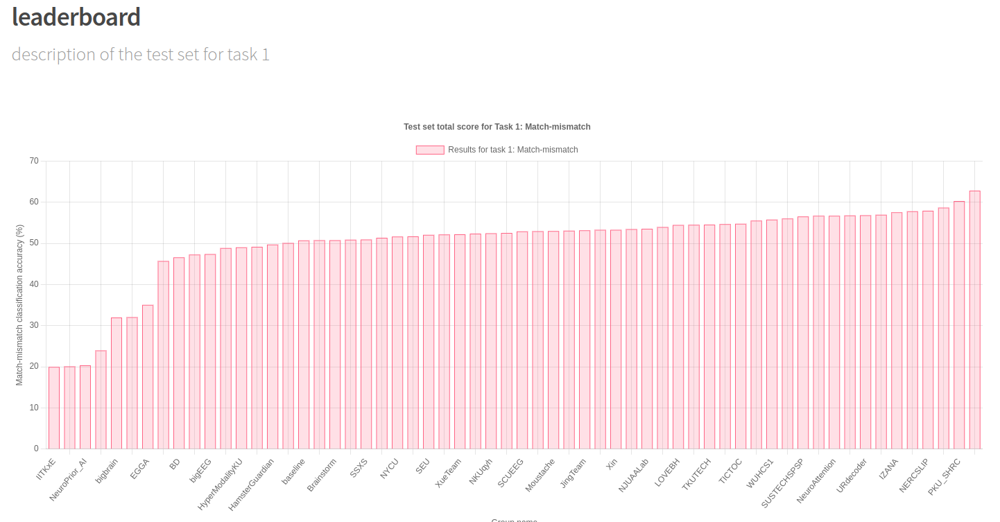
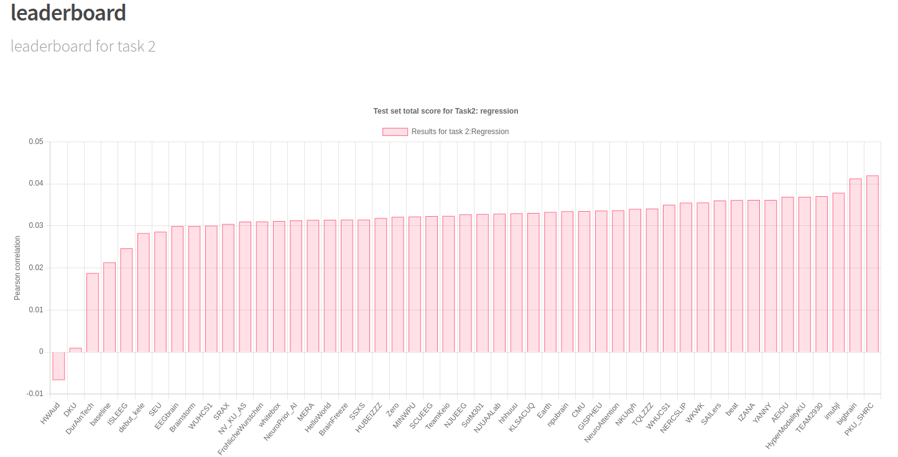

# An EEmaGe System Design: A report for Graduation Project II

$$
\mathbf{Wonjun\ Park,\ Esan\ Woo,\ Hyunwoo\ Lee} \\
\mathrm{Computer\ Science\ and\ Engineering} \\
\mathrm{Konkuk\ University} \\
\mathrm{Seoul,\ South\ Korea} \\
\mathrm{\{kuwjjgjk, esan23, l2hyunwoo\}@konkuk.ac.kr}
$$

### *Abstract*

시스템 설계는 물론 매우 중요하므로, 대부분의 개발자와 엔지니어들은 시스템을 설계하는 데 시간을 소비합니다. 그럼에도 불구하고 모든 것은 시간이 지나면서 변합니다. 애자일과 같은 변화할 수 있는 능력은 어떤 관점에서는 적응이 필요하다는 것을 증명합니다. 새 학기가 시작함에 따라, 이 보고서에서는 지난 학기에 고안된 시스템의 설계와 현재의 방법론에 대해 검토합니다. 구체적으로, Electroencephalography (EEG) 신호를 가지고 이미지와 오디오를 재구성하는 프레임워크인 EEmaGe에 대해 점검하고, 이전 학기의 보고서와 현재의 차이점이 존재하는지 비교합니다. 우리는 보고서를 통해 우리가 고안해온 길이 옳았음을 입증하기를 기대합니다. (이후 보고서에서는 문어체를 사용합니다.)

$$ \mathbf{Acronym / Abbreviation} \\
\begin{array}{|c|c|}
\hline
\text{Electroencephalography (EEG)} & \text{Brain-Computer Interface (BCI)} \\
\hline
\text{Self-Supervised Learning (SSL)} & \text{Mean Squared Error (MSE)} \\
\hline
\text{Frechet Inception Distance (FID)} & \text{Inception Score (IS)} \\
\hline
\end{array} $$

## I. Introduction

사물은 누군가의 인식과 관계없이 항상 존재한다. 이것은 looking, seeing, and watching의 정의가 다르다는 점에 영향을 미친다. Looking은 눈을 어딘가로 향하는 것이고, Seeing은 눈이 향하는 곳을 지각하는 것이며, Watching은 시간을 들여 사물에 주의를 기울이는 것이다 [12]. 다시 말해, 'watching'은 'seeing' 집합에 속하고, 다시 'seeing'은 'looking' 집합에 속한다. 인간의 시각 시스템은 looking을 수행한다. 이는 이러한 시스템을 모방하기 위해 지도(Supervision)가 필요하지 않음을 뜻한다.

Vidal이 처음 제안한 Brain-Computer Interface (BCI)는 아직 정복되지 않은 인간 두뇌의 핵심을 탐구해 왔다. BCI 연구가 지속적응로 발전한다면 장애인들도 비장애인들과 함께 실생활을 영위할 수 있을 것으로 기대된다. BCI 방법론 중 Electroencephalography (EEG) 분석은 특히 뇌파 측정 분야에서 비침습적, 비용 효율적인 센서라는 장점을 가지고 있다. 뇌의 전기적 신호를 기록, 이용하는 이 분석은 뇌질환 진단을 위한 의료 및 연구 분야에서 널리 사용되고 있다. 이러한 분야에서 효율성이 입증되었지만, EEG 분석은 의사 및 연구자와 같은 전문자의 수동 분석을 여전히 필요로 한다 [14].

인공지능, 그 속에서도 기계학습은 크게 Supervised Learning, Self-Supervised Learning, Semi-Supervised Learning, Reinforcement Learning의 4가지로 분류한다. 지금까지의 연구 대부분은 Image와 해당 Image를 바라보는 피험자에게서 관측한 EEG Signal을 Input과 Label(정답)로 연결하여, 주어진 EEG Signal이 정답 Image와 유사한 Image를 재현해내도록 학습하는 Supervised-Learning 방식으로 진행해왔다.

아직까지 연속성이 있는 시계열 Data를 분석하는 데에 한계가 존재하며, 비선형적이기까지한 EEG Signal은 Supervised Learning을 통해 학습하는데에 어려움이 있다. 이를 타파하기 위해 오토인코더를 접목한 연구가 진행되었지만, 인코딩 방법에 여전히 Visual Cue를 사용하며 Labeling을 필요로 한다는 한계가 존재한다.

우리는 다운스트림 작업을 수반하는 Self-Supervised Learning (SSL) 오토인코더를 사용하는 EEmaGe를 제안한다. EEmaGe는 다음과 같은 가설을 증명하도록 설계되었다.

* 인간의 시각 시스템을 구성하는 데에는 지도가 필요하지 않다.
* EEG 특징 추출에서 Visual Cues를 제외하는 것이 궁극적으로 필요하다.

## II. System Review

본 섹션에서는 지난 학기에 고안된 시스템의 설계를 task 별로 다룬다. **A. Image Reconstruction**은 뇌파 신호로부터 이미지를 재생성하는 것에 관한 것이었다. **B. Audio Reconstruction**은 녹음된 EEG 신호로부터 Audio Stimuli를 복원하는 작업이었다. **C. Reconstruction With General BCI**에서는 EEG 신호로부터 원본 영상과 소리를 만들기 위한 통합 모델을 제안하였다.

#### A. Image Reconstruction

$\text{Fig 4. A Basic Framework of Image Reconstruction}$

우리의 가설에 따라 SSL, 특히 오토인코더 아키텍처를 시스템 설계에 채택하였다. 오토인코더는 EEG와 이미지 쌍을 입력으로 받았다.

$\text{Fig 5. A Model Architecture for Image Reconstruction}$

#### B. Audio Reconstruction

지난 학기 중, 우리는 지도교수님으로부터 ICASSP 2024 [1]의 EEG-Audio Reconstruction 챌린지에 참여해보자는 피드백을 받았다. ICASSP는 International Conference on Acoustic, Speech, and Signal Process의 약자로 impact score는 3.59이다 [2]. 이 챌린지는 2023년 12월 28일까지 벨기에 KU Leuven에 의해 열렸다. 챌린지 참가자들에게는 두 가지 과제가 제시되었다: 5개의 음성 segment와 하나의 EEG segment가 주어졌을 때, 일치하는 EEG segment와 일치하는 Audio Segment를 찾는 **1) match-mismatch**, EEG 신호로부터 mel-spectrogram을 재구성하는 **2) regression**. 참가자들에게는 SparrKULee [3]라는 데이터 세트가 제공되었다. 이러한 경험을 통해 우리는 이미지, 오디오 등 다양한 영역에서 성능을 발휘할 수 있는 Generalized BCI를 추구하게 되었다. 이 BCI에 대한 자세한 내용은 **C. Reconstruction With General BCI for Image and Audio**에서 다룬다.

챌린지의 한계에 도전하기 위해, 우리는 "이미지와 오디오 데이터를 동시에 처리하는 것은 그 둘의 유사성 때문에 가능하다"라는 가설을 채택했다 [4,5]. 다른 연구자들이 제안한 EEG-Image 인코더는 task 1,2에서 의미 있는 벡터를 추출하기 위해 활용되었다. EEG 인코더는 Palazzo, et al. [6] 이 제안한 EEG-ChannelNet을 활용하였고, 오디오 인코더는 Hubert [7]를 사용하였다. $Fig. 1$은 task 1을 해결하기 위해 사용한 특정한 모델 설계이다.

$\text{Fig 1. A Model Architecture for Audio Reconstruction}$

각 인코더는 특징 벡터를 계산하고 벡터의 유사성을 Consine Similarity를 이용해 비교했다. Task 2의 경우 손실 함수로 Pearson Correlation을 사용하였다. HyperModalityKU는 우리가 챌린지에 참여할 때 사용한 팀명이며, $\text{Fig. 3}$은 챌린지 결과를 보여준다.

$\text{Fig 3. The Leaderboard of The Challenge}$

#### C. Reconstruction With General BCI for Image and Audio

위와 같은 **A. Image Reconstrucion**과 **B. Audio Reconstruction**의 접근 방식으로, 우리는 이미지와 오디오 모두를 해결하는 Multimodality를 가진 General BCI를 설계했었다.

$\text{Fig 2. A Model Architecture for General BCI}$

$\text{Fig 2}$에서 보이는 것과 같이, 두 개의 인코더는 학습 과정에서 가중치를 공유하도록 설계되었다.

## III. Methodology

보고서는 지난 학기에 계획한 시스템 설계를 검토했다. 이 프로젝트에는 이미지, 오디오, 그리고 둘 다를 사용하는 세 가지 목표가 제시되었다. 그러나 EEG-audio 챌린지의 전체적인 결과는 현재로써는 General BCI로의 direct한 달성에 어려움이 있음을 보여주었다. 다시 말해, General BCI를 달성하기 위해서는 이미지와 오디오의 재구성을 의미하는 각각의 목표가 선행되어야 한다. 이 섹션에서는 EEG 신호로부터 시각적 자극을 재구성하는 EEmaGe라는 프레임워크를 보여주며 다시금 시각 이미지 재현이라는 본래 목표에 집중한다.

#### A. EEmaGe

이미지 재현에서는 SSL과 그 Downstream task가 지도를 배제하기 위해 여전히 EEmaGe에 채택되었다. EEmaGe는 $e$가 EEG이고, $i$가 이미지인 입력 $(e,i)$쌍을 얻는 오토인코더 기반 모델 아키텍처를 가진다.

**Training** 두 개의 오토인코더의 인코더들이 서로 가중치를 공유하는 아키텍처를 구성한다. 각각의 인코더에는 동일한 인코더 구조로 feed-forward하기 위한 전처리 블록이 존재한다. 이러한 오토인코더는 Mean Square Error (MSE) 손실 함수$\cdots (1)$를 사용하여 동시에 역전파된다. 구체적으로, 전체 모델의 손실 함수는 EEG 오토인코더의 Loss $L_{\text{eeg}}$와 이미지 오토인코더의 Loss $L_{\text{image}}$의 손실을 합한 것으로 정의되며, 식은 $(2)$와 같다.

$$
(1)\ \text{MSE} = {1 \over n} \sum_{i=1}^n {(Y_i - \hat{Y_i})}^2 \\
(2)\ \text{Loss} = L_{\text{eeg}} + L_{\text{image}}
$$

**Downstream Task** Downstream task는 오토인코더를 사용하여 EEG 신호로부터 이미지를 재구성하는 것으로 정의된다. EEG 인코더와 이미지 디코더를 EEmaGe 아키텍쳐로부터 가져와, 오토인코더 형태로 추론이 이루어지며 이 때 이미지가 생성된다. 이 작업은 **1)** 오토인코더 그 자체를 foundation model로 사용하는 것과 **2)** 오토인코더를 Fine-tuning하여 성능을 최대화하는 것으로 구분할 수 있다. 현재로서는 **1)** 만으로도 만족스러운 성능을 기대한다. 하지만 그렇지 못할 경우, **2)** 가 고려된다. **2)** 의 내용에는 지도가 포함되어 있음에도 불구하고, EEG의 Foundation model을 제안했다는 점에서 여전히 연구의 Novelty를 유지할 수 있다. 해당 연구에서는 기본적으로 두 가지의 성능을 모두 보여주어 EEmaGe의 타당성을 획득할 것이다.

#### B. Performance Evaluation

성능 평가를 위해, 현재 생성 모델을 평가하는 데에 표준 metric로 사용되는 Frechet Inception Distance (FID) [15]를 사용할 계획이다. 생성된 이미지의 분포만을 평가하는 Inception Score (IS)와 달리 FID는 원본 이미지에서 생성된 이미지의 분포까지 비교해 평가한다. 본 연구가 결국 실제 현실과 얼마나 같았는 지를 평가지표로 삼아야 하기 때문에 FID를 채택하였다.

## IV. Implementation

#### A. EEG-Image Pair Dataset

시각 재현 Task에 대하여, 두 개의 보증된 접근 가능한 데이터셋이 비교되었다.

**Thoughtviz Dataset** Thoughtviz [8] 데이터셋은 Kumar, et al. [9]가 Audio-EEG Task를 위해 수집한 데이터셋을 활용한, 참가자가 해당 이미지를 상상했다는 데에 기반하였다. 참여자의 생각을 바탕으로 수집된 이 데이터셋에는 그들의 생각에 의해 유도된 alpha wave가 주를 이룬다고 판단한다.

**PerceiveLab Dataset** 사실, 사람이 눈을 뜨고 있는 동안에는 EEG beta wave가 지배적이다 [10]. Palazzo, et al [11]은 6명의 참가자로부터 EEG와 이미지 데이터 쌍을 수집했다. 클래스 수가 40개인 클래스당 50개의 이미지로 구성된 ImageNet의 Subset이 연구자들에 의해 선택되었다. 결과적으로 이 데이터셋은 128개의 EEG 채널을 통해 12,000개의 EEG Sequence (2,000개의 이미지 x 6명의 참가자)가 수집되었다. 현재 공개된 데이터 셋상에는 전처리를 통해 유효한 시퀀스만을 공개하여 11,466개의 EEG Sequence가 존재한다.

우리는 **1)** 데이터셋에서 이미 엮어놓은 EEG-image 쌍을 학습하는 것과, **2)** 궁극적으로 우리의 두 번째 가설을 달성하기 위해 쌍을 섞어 학습하는, 두 가지 실험을 설계했다. DataLoader는 $(e, i)$ input쌍으로 입력을 제공한다.

#### B. Development Environment

Intel i5-10400F CPU, GTX 1660Ti GPU 및 Samsung 8GB 2666Hz RAM 2개가 장착된 Bare metal 컴퓨터를 모델 훈련에 사용한다. Python 및 관련 프레임워들의 버전은 Python 3.10.12, PyTorch 2.2 그리고 Tensorflow 2.13.0이다. 더 자세한 정보는 프로젝트 저장소의 requirements.txt 파일에 저장되어 있다.

## V. Conclusion

새 학기가 시작함에 따라, 이 보고서는 EEmaGe라는 시스템의 설계를 점검했다. 이 프레임워크는 EEG신호로부터 인간의 경험을 재구성하기 위해 설계되었다. 시스템과 그 구성 요소가 어떻게 구체적으로 설계되었는지 확인하면서, 구성 요소의 세부사항이 추가된 것을 확인하였다. 그렇지만 큰 방향성이 여전히 같다는 점에서, 본 보고서는 지난 학기에 수행된 우리의 설계가 설득력이 있었다고 결론지었다. 우리는 우리가 제안한 접근 방식을 통해 궁극적으로 General BCI 애플리케이션 개발에 기여할 것으로 기대한다.

## References

* [1] https://exporl.github.io/auditory-eeg-challenge-2024/ . accessed in Mar 11, 2024 [URL]
* [2] https://www.resurchify.com/impact/details/110544 . accessed in Mar 11, 2024 [?]
* [3] Accou, Bernd, et al. "SparrKULee: A Speech-evoked Auditory Response Repository of the KU Leuven, containing EEG of 85 participants." bioRxiv (2023): 2023-07. [MLA]
* [4] Likhosherstov, Valerii, et al. "Polyvit: Co-training vision transformers on images, videos and audio." arXiv preprint arXiv:2111.12993 (2021). [MLA]
* [5] Y. Gong, A. H. Liu, A. Rouditchenko and J. Glass, "UAVM: Towards Unifying Audio and Visual Models," in IEEE Signal Processing Letters, vol. 29, pp. 2437-2441, 2022, doi: 10.1109/LSP.2022.3224688. [IEEE]
* [6] S. Palazzo, C. Spampinato, I. Kavasidis, D. Giordano, J. Schmidt and M. Shah, "Decoding Brain Representations by Multimodal Learning of Neural Activity and Visual Features," in IEEE Transactions on Pattern Analysis and Machine Intelligence, vol. 43, no. 11, pp. 3833-3849, 1 Nov. 2021, doi: 10.1109/TPAMI.2020.2995909. [IEEE]
* [7] W. -N. Hsu, B. Bolte, Y. -H. H. Tsai, K. Lakhotia, R. Salakhutdinov and A. Mohamed, "HuBERT: Self-Supervised Speech Representation Learning by Masked Prediction of Hidden Units," in IEEE/ACM Transactions on Audio, Speech, and Language Processing, vol. 29, pp. 3451-3460, 2021, doi: 10.1109/TASLP.2021.3122291. [IEEE]
* [8] Tirupattur, Praveen, et al. "Thoughtviz: Visualizing human thoughts using generative adversarial network." Proceedings of the 26th ACM international conference on Multimedia. 2018. [MLA]
* [9] Kumar, Pradeep, et al. "Envisioned speech recognition using EEG sensors." Personal and Ubiquitous Computing 22 (2018): 185-199. [MLA]
* [10] Teplan, Michal. "Fundamentals of EEG measurement." Measurement science review 2.2 (2002): 1-11. [MLA]
* [11] S. Palazzo, C. Spampinato, I. Kavasidis, D. Giordano and M. Shah, "Generative Adversarial Networks Conditioned by Brain Signals," 2017 IEEE International Conference on Computer Vision (ICCV), Venice, Italy, 2017, pp. 3430-3438, doi: 10.1109/ICCV.2017.369. [IEEE]
* [12] https://www.britannica.com/dictionary/eb/qa/see-look-watch-hear-and-listen , accessed in Mar 4 2024. [URL]
* [13] Vidal, Jacques J. "Toward direct brain-computer communication." Annual review of Biophysics and Bioengineering 2.1 (1973): 157-180. [MLA]
* [14] https://www.kaggle.com/competitions/hms-harmful-brain-activity-classification/overview , accessed in Mar 4 2024. [URL]
* [15] Heusel, Martin, et al. "Gans trained by a two time-scale update rule converge to a local nash equilibrium." Advances in neural information processing systems 30 (2017). [MLA]
