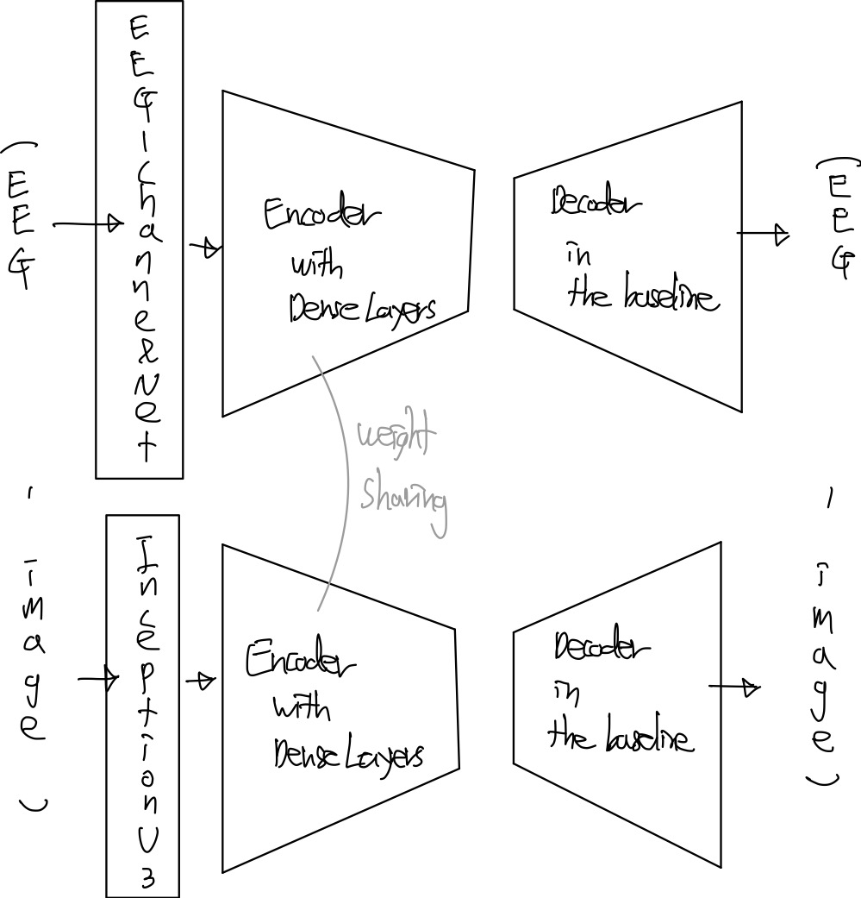

# An EEmaGe System Design: A Report for Graduation Project II

$$
\mathbf{\text{Wonjun Park, Esan Woo, Hyunwoo Lee}} \\
\mathrm{\text{Computer Science and Engineering}} \\
\mathrm{\text{Konkuk University}} \\
\mathrm{\text{Seoul, South Korea}} \\
\mathrm{\text{\{kuwjjgjk, esan23, l2hyunwoo\}@konkuk.ac.kr}}
$$

### *Abstract*

We propose EEmaGe, a new framework for EEG-based visual Image Generation. In order to handle this multidisciplinary field including AI in Computer Science, a precise design should be followed to build the framework. The report provides a detailed explanation of how to build the framework, helping readers who are curious about our project to better understand it. We expect that the report is sound to develop the framework.

$$
\mathbf{\large{\text{Acronym / Abbreviation}}} \\
\begin{array}{|c|c|}
\hline
\text{ElectroEncephaloGraphy (EEG)} & \text{Artificial Intelligence (AI)} \\
\hline
\text{Brain-Computer Interface (BCI)} & \text{Self-Supervised Learning (SSL)} \\
\hline
\text{Machine Learning (ML)} & \text{Reconstruction EEG to Image (RE2I)} \\
\hline
\text{Frechet Inception Distance (FID)} & \text{Bidirectional Encoder Representations from Transformers (BERT)} \\
\hline
\text{Generative Per-trained Transformer (GPT)} & \text{Mean Square Error (MSE)} \\
\hline
\text{Visual Geometry Group (VGG)} & \text{Residual Network (ResNet)} \\
\hline
\end{array}
$$

**Keywords**: BCI, EEG, RE2I, Unsupervised Learning, Autoencoder

## I. INTRODUCTION

Objects always exist regardless of someone's perception. This influenced that the definitions of looking, seeing, and watching are different. Looking is to toward eyes somewhere, seeing is to perceive things what eyes direct, and watching is to spend time and pay attention to the things [[1]](#mjx-eqn-1). In other words, 'looking' belongs to the 'seeing' set and 'seeing' belongs to the 'watching' set. The visual system of humans performs looking, meaning that, supervision is not required to imitate the system.

BCI, firstly proposed by Vidal [[2]](#mjx-eqn-2), has seeked to the key of the human brain where the area has yet been conquered. Disabled people are expected to be benefited to live real lives with non-disabled people, if BCI researches continuously evolve. Among the methodlogies of BCIs, EEG analysis has especially been drawn attention due to its advantages, non-invasive and cost-effective sensors which are utilized during brain measurements. The analysis, which uses a signal recorded electrical activities of brains [[3]](#mjx-eqn-3), is pervasively adopted in medical and research areas to diagnose brain diseases. Even though its effectiveness in those areas, EEG required manual analysis of experts like physicians and researchers [[4]](#mjx-eqn-4).

Especially ML, the learning techniques of AI is categorized into four categories. **Supervised Learning** is instructed during its training step with labeled data. **Unsupervised Learning** proceeds the training step with unlabeled data. **Semi-supervised Learning** uses both labeled and unlabeled data and **Reinforcement Learning** defines functions like a reward function to let models find the right answer. RE2I has mostly been proved with Supervised methods<!--due to the difficulty to handle the EEG temporal data-->. [[13](#mjx-eqn-13), [8](#mjx-eqn-8), [9](#mjx-eqn-9), [14](#mjx-eqn-14)] proposed their own supervised methods to regenerate visual images, showing the successful reproduced images from EEG signals. In fact, Unsupervised Learning like BERT [[11]](#mjx-eqn-11) and GPT [[12]](#mjx-eqn-12) has recently presented its effectiveness, affecting on the real world. Although, after this moment, many researchers adopted unsupervised learning in their fields, RE2I has yet been scarce to apply the method.

We propose an EEmaGe which uses SSL autoencoders entailing downstream tasks. EEmaGe is designed to prove our following hypotheses:\
$\Large{\cdot}$ Supervision is not required to construct the human's visual system.\
$\Large{\cdot}$ Excluding visual cues from extracting EEG features are ultimately required.

In summary, EEmaGe targets a new framework with Unsupervised Learning for visual image reconstruction, contributing to both the deep understand of human brain and the foundation to overcome a disability and to improve a capacity of brain.

## II. METHODOLOGY

In the last report of system design, the whole tasks of the project were shown to review our path and vision. As the last report described, however, image reconstruction from EEG should be refocused. This report goes the extra miles to illustrate the details of EEmaGe so that developers whoever read the report can produce or reproduce the process of the development. The section is composed by # steps: **1)** EEG-Image Pair Dataset which are trained EEmaGe including their input shapes, **2)** EEmaGe from its architectures and training steps, and **3)** Performance Metrics which evaluate a image dataset generated by EEmaGe.

#### A. EEG-Image Pair Dataset

For the task of RE2I, two qualified datasets were available;

**Thoughtviz Dataset** Yet, Thoughtviz [[5]](#mjx-eqn-5) dataset, originated from Kumar, et al. [[6]](#mjx-eqn-6) who collected an EEG dataset for the speech recognition task, utilized imaginary images of participants. The dataset collected by relying on the thought of the participants has an alpha wave data induced by thinking. The report conclude that the dataset is not suitable for the specific task which is derived from our hypotheses.

**PerceiveLab Dataset** In fact, the EEG beta waves where the band of EEG frequency is higher than 13 $Hz$ are dominant while the eyes open [[7]](#mjx-eqn-7). With a PerceiveLab Dataset [[8]](#mjx-eqn-8), collected the pairs of EEG and image data from six participants, Palazzo, et al [[9]](#mjx-eqn-9) confirmed that the EEG frequency band between 55 and 95 $Hz$, where cognitive neuroscience believes that this spectrum is related to cognitive processes, is compelling to reconstruct visual images. The ImageNet subset, consisting of fifty images per class where the number of the class is forty, were selected by those researchers. Consequently, 12,000 EEG sequences (2000 images * 6 participants) were gathered via 128 EEG channels. Few sequences were excluded through preprocessing so that 11,466 were valid to account for the opened dataset.

In conclusion, we designed two types of input shapes that **1)** use the EEG-image pair already matched in the dataset and **2)** shuffle the pair to ultimately achieve our second hypothesis. An input $(e, i)$ pair where $e$ is an EEG and $i$ is an image was given to the model. The $(e, i)$ pair is also used as an output which EEmage targets to be trained. Other parameters like a window length of EEG follow the PerceiveLab Dataset.

#### B. EEmaGe

To implement the hypotheses, SSL and its downstrea task have been designed for EEmaGe. EEmaGe is an autoencoder-based model architecture which gets an input $(e, i)$ pair where $e$ is an EEG and $i$ is an image. Two autoencoders which their encoders share weights with themselves comprise the architecture. Each encoder has a preprocessing block in front of its input to feed-forward into the same encoder structure. Specifically, we design two kinds of architectures. One, which is called Baseline, is composed by both convolution layers in the preprocessing blocks as well as encoder and deconvolution layers in decoder. AE-CDNN [[17](#mjx-eqn-17), [18](#mjx-eqn-18)], a convolutional autoencoder is adopted for the Baseline. Other, which is differed in the preprocessing blocks from the Baseline, utilize the feature extractor of EEG-ChannelNet [[9]](#mjx-eqn-9) for the EEG preprocessing block and the feature extractor of the well-known encoders like VGG [[15]](#mjx-eqn-15) and ResNet [[16]](#mjx-eqn-16).

|||
|--|--|
|$\text{Fig 1. Baseline Architecture}$|$\text{Fig 2. Variation Architecture in Preprocessing Blocks}$|

#### C. Performance Metrics

To evaluate the performance, FID [[10]](#mjx-eqn-10), the current standard metric to assess generative models, is planned to use. Unlike IS which evaluates the distribution of the generated images, FID evaluates the distributions from the original images to the generated images.

## III. IMPLEMENTATION

#### A. Training

The model that introduced in previous section is back-propagated with a loss function MSE $\cdots (1)$. To be specific, the loss function of the compounded model is a sum of a loss from the EEG autoencoder $L_{\text{eeg}}$ and a loss from the image autoencoder $L_\text{image}$. The formula is written in $\cdots (2)$.

$$
(1)\ \text{MSE} = {1 \over n} \sum_{i=1}^n {(Y_i - \hat{Y_i})}^2 \\
(2)\ \text{Loss} = L_{\text{eeg}} + L_{\text{image}}
$$

#### B. Downstream Task

A downstream task is defined as reconstructing images from EEG signals with an autoencoder. Transferring the EEG encoder and the image decoder from EEmage, inferences of the autoencoder implement to generate images. This task can be differentiated with **1)** utilizing the autoencoder as a foundation model itself and **2)** fine-tuning the autoencoder to maximize its performance. Even though **2)** contains the supervision, the novelty of the research is still found on the proposal of the EEG foundational model. We will present the two cases to sound the performance of EEmaGe.

## IV. CONCLUSION

We have introduced EEmaGe, EEG-based visual Image Generation since the Graduation Project $\text{I}$ lecture started. The report tackled the design of the system in detail, concluding that EEmaGe is enabled to develop hinged on this report.

## References

$\tag*{}\label{1} \text{[1] https://www.britannica.com/dictionary/eb/qa/see-look-watch-hear-and-listen, accessed in Mar. 4 2024 [URL]}$
$\tag*{}\label{2} \text{[2] Vidal, Jacques J. "Toward direct brain-computer communication." Annual review of Biophysics and Bioengineering 2.1}\\\text{ (1973): 157-180. [MLA]}$
$\tag*{}\label{3} \text{[3] Teplan, Michal. "Fundamentals of EEG measurement." Measurement science review 2.2 (2002): 1-11. [MLA]}$
$\tag*{}\label{4} \text{[4] https://www.kaggle.com/competitions/hms-harmful-brain-activity-classification/overview, accessed in Mar 4 2024. [URL]}$
$\tag*{}\label{5} \text{[5] Tirupattur, Praveen, et al. "Thoughtviz: Visualizing human thoughts using generative adversarial network." Proceedings of the 26th }\\\text{ACM international conference on Multimedia. 2018. [MLA]}$
$\tag*{}\label{6} \text{[6] Kumar, Pradeep, et al. "Envisioned speech recognition using EEG sensors." Personal and Ubiquitous Computing 22 }\\\text{(2018): 185-199. [MLA]}$
$\tag*{}\label{7} \text{[7] Teplan, Michal. "Fundamentals of EEG measurement." Measurement science review 2.2 (2002): 1-11. [MLA]}$
$\tag*{}\label{8} \text{[8] S. Palazzo, C. Spampinato, I. Kavasidis, D. Giordano and M. Shah, "Generative Adversarial Networks Conditioned by Brain Signals,"}\\\text{ 2017 IEEE International Conference on Computer Vision (ICCV), Venice, Italy, 2017, pp. 3430-3438, doi: 10.1109/ICCV.2017.369. [IEEE]}$
$\tag*{}\label{9} \text{[9] S. Palazzo, C. Spampinato, I. Kavasidis, D. Giordano, J. Schmidt and M. Shah, "Decoding Brain Representations by Multimodal }\\\text{Learning of Neural Activity and Visual Features," in IEEE Transactions on Pattern Analysis and Machine Intelligence, vol. 43, no. 11, }\\\text{pp. 3833-3849, 1 Nov. 2021, doi: 10.1109/TPAMI.2020.2995909. [IEEE]}$
$\tag*{}\label{10} \text{[10] Heusel, Martin, et al. "Gans trained by a two time-scale update rule converge to a local nash equilibrium." Advances in neural }\\\text{information processing systems 30 (2017). [MLA]}$
$\tag*{}\label{11} \text{[11] Devlin, Jacob, et al. "Bert: Pre-training of deep bidirectional transformers for language understanding." arXiv preprint }\\\text{arXiv:1810.04805 (2018). [MLA]}$
$\tag*{}\label{12} \text{[12] Radford, Alec, et al. "Improving language understanding by generative pre-training." (2018). [MLA]}$
$\tag*{}\label{13} \text{[13] Kavasidis, Isaak, et al. "Brain2image: Converting brain signals into images." Proceedings of the 25th ACM international conference on }\\\text{Multimedia. 2017. [MLA]}$
$\tag*{}\label{14} \text{[14] P. Singh, P. Pandey, K. Miyapuram and S. Raman, "EEG2IMAGE: Image Reconstruction from EEG Brain Signals," ICASSP 2023 - }\\\text{2023 IEEE International Conference on Acoustics, Speech and Signal Processing (ICASSP), Rhodes Island, Greece, 2023, pp. 1-5, }\\\text{doi: 10.1109/ICASSP49357.2023.10096587. [IEEE]}$
$\tag*{}\label{15} \text{[15] Simonyan, Karen, and Andrew Zisserman. "Very deep convolutional networks for large-scale image recognition." arXiv preprint }\\\text{arXiv:1409.1556 (2014). [MLA]}$
$\tag*{}\label{16} \text{[16] K. He, X. Zhang, S. Ren and J. Sun, "Deep Residual Learning for Image Recognition," 2016 IEEE Conference on Computer Vision }\\\text{and Pattern Recognition (CVPR), Las Vegas, NV, USA, 2016, pp. 770-778, doi: 10.1109/CVPR.2016.90. [IEEE]}$
$\tag*{}\label{17} \text{[17] T. Wen and Z. Zhang, "Deep Convolution Neural Network and Autoencoders-Based Unsupervised Feature Learning of EEG Signals," }\\\text{in IEEE Access, vol. 6, pp. 25399-25410, 2018, doi: 10.1109/ACCESS.2018.2833746. [IEEE]}$
$\tag*{}\label{18} \text{[18] https://github.com/bruAristimunha/Re-Deep-Convolution-Neural-Network-and-Autoencoders-Based-Unsupervised-Feature}\\\text{-Learning-of-EEG, accessed in Mar. 25 2024 [URL]}$

